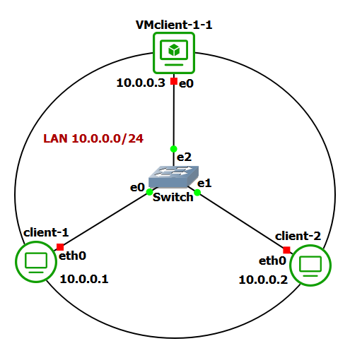

# Hands-on GNS3
Semplice topologia iniziale con 1 switch e 3 client (2 container docker ed 1 macchina virtuale). I client fanno parte della stessa sottorete e sono connessi attraverso uno switch ethernet.



## Step 1
Configurare la macchina virtuale Lubuntu mediante il network manager. In particolare, aprire ```Advanced Network Configuration``` sulla VM ed impostare:
* ```Address: 10.0.0.3```
* ```Netmask: 24```
* ```Gateway: 10.0.0.254```

## Step 2
Configurare gli indirizzi IP per i container docker. In particolare, per il client 1 (scripts/client1/setup.sh):
```
ip addr add 10.0.0.1/24 dev eth0
```
Per il client 2 (scripts/client2/setup.sh):
```
ip addr add 10.0.0.2/24 dev eth0
```
