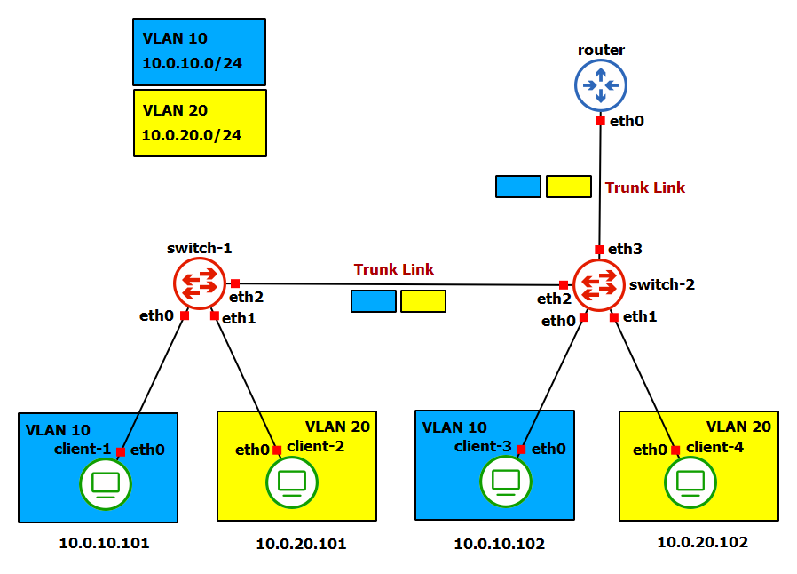

# VLAN
Una **VLAN** (Virtual Local Area Network) è una tecnologia di rete che consente di creare una suddivisione logica di una rete fisica in segmenti logici isolati, ottenendo così delle reti separate. Per poter comunicare, due segmenti diversi hanno bisogno di un *router*, mentre i dispositivi appartenenti allo stesso segmento possono comunicare attraverso un normale *switch*. Uno switch che supporta le VLAN include anche un **VLAN #** per ogni entry della *MAC Address Table*. Un aspetto fondamentale è che le VLAN possono essere estese andando a collegare tra loro diversi switch. Tuttavia, per far comunicare due host su VLAN differenti, l'utilizzo del solo switch non è sufficiente poiché si sta uscendo da una rete privata ed è necessario l'utilizzo di un router. Negli switch che supportano le VLAN possiamo distinguere due tipi di link:
* *Access Link*: sono link in cui passano soltanto frame appartenenti ad un'unica VLAN. Questo significa che i frame che circolano su questi collegamenti sono untagged. Le porte alle quali si connettono questi link sono dette *Access Ports*. Tipicamente, questo tipo di link vengono utilizzati per connettere PC/hub ad uno switch.
* *Trunk Link*: sono link in cui passano frame appartenenti a più di una VLAN. Le porte alle quali questi link si collegano sono dette *Trunk Port*. Questi link supportano frame Ethernet taggati esplicitamente per distinguere le differenti VLAN.

Tipicamente, gli *end-host* sono connessi tramite *Access Link*, mentre i dispositivi delle rete sono connessi tra loro mediante *Trunk Link*, in modo tale da ridurre il numero di porte utilizzate per la topologia di rete. Inoltre, in questo modo gli *end-host* sono completamente ignari di trovarsi dietro ad una VLAN e perciò possono inviare i loro frame "*untagged*" come se li stessero inviando in una normale rete privata. Tuttavia, un *end-host* può comunque inviare un frame *tagged*. A causa di questo fatto, se uno switch riceve da un *Trunk Link* un pacchetto taggato, deve modificare l'header rimuovendo quel campo e ricalcolando il CRC: un *end-host* si aspetta di ricevere frame classici senza campi aggiuntivi nell'header. Casi particolari sono invece quelli di un server o di un host che ospita più di una macchina virtuale: in questo caso è necessario usare *Trunk Link*. Vi è un altro concetto fondamentale tale per cui non è vero che un *Trunk Link* è attraversato esclusivamente da frame taggati. Infatti, vi è il concetto di *Native VLAN*, sostanzialmente una VLAN di default (tipicamente la VLAN #1) a cui trasmettere frame non taggati provenienti da un *Trunk Link*. Affinché la comunicazione vada a buon fine è necessario che la *Native VLAN* sia la stessa ai due estremi del *Trunk Link*. Nel laboratorio successivo (Lab04_VLAN_Attack) viene anche mostrato uno scenario di attacco in cui non è vero che un *Access Link* è attraversato esclusivamente da pacchetti untagged.

# Laboratorio

Il router e gli switch utilizzati nella topologia sono i soliti container docker (nsdcourse/basenet) con la differenza che hanno più interfacce di rete e sono configurati in maniera opportuna.

## Configurazione degli switch

## Configurazione del router

## Configurazione dei client