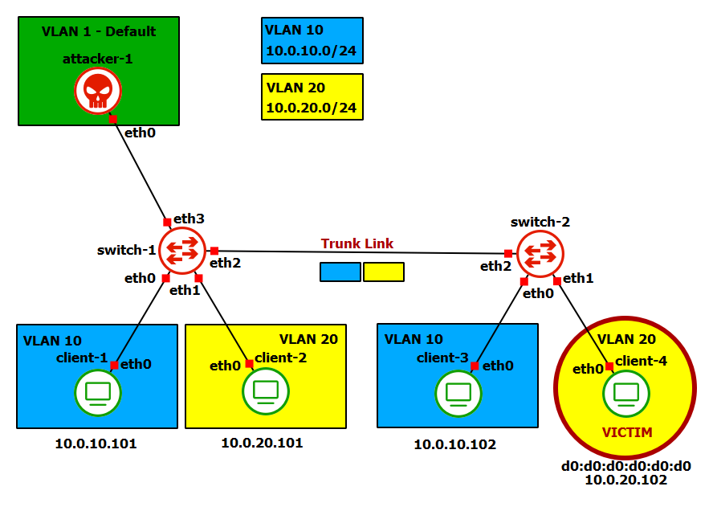

# VLAN: Double Tagging Attack
Il **Double Tagging Attack** prevede che l'attaccante sia connesso tramite un *Trunk Link* ad uno switch, e che possa inviare pacchetti taggati con l'id della native VLAN dello switch. Con queste premesse l'attacco funziona sfruttando il comportamento tipico dello switch di quando deve inoltrare un pacchetto appartenente alla sua native VLAN: il pacchetto viene inoltrato *untagged*. Più precisamente, il tag relativo alla native VLAN, se presente, viene rimosso. L'idea è quindi quella di inviare un pacchetto con due tag: il primo tag deve essere quello della nativa VLAN dello switch, il secondo tag è invece quello della rete VLAN verso cui si vuole inoltrare il pacchetto. Così facendo, il pacchetto ricevuto dallo switch viene manipolato affinché il primo tag venga rimosso, senza sapere che a seguire c'è un ulteriore tag di un'altra VLAN. Il pacchetto che viene inoltrato sarà quindi un pacchetto legale diretto verso una VLAN a cui l'attaccante non appartiene. Osserviamo che questo attacco consente ad un attaccante di inviare pacchetti verso un'altra VLAN, ma non di riceverne.

# Laboratorio

Partiamo da una topologia simile a quella del laboratorio sulle VLAN. In questo caso togliamo però il router in quanto non vogliamo consentire la comunicazione inter-VLAN. L'attaccante è connesso ad un *Trunk Link*. Lo scopo del laboratorio è quello di simulare un **Double Tagging Attack**, ovvero di inviare pacchetti ad una vittima nella VLAN 20 anche se l'attaccante si trova in un'altra VLAN e la comunicazione inter-VLAN via un IP GW non è consentita.

## Configurazione degli switch

## Configurazione del router

## Configurazione dei client