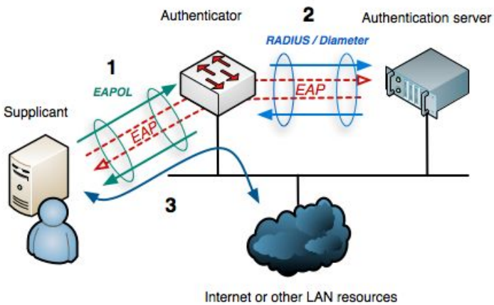
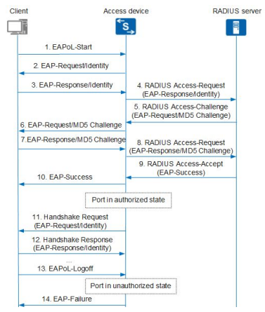
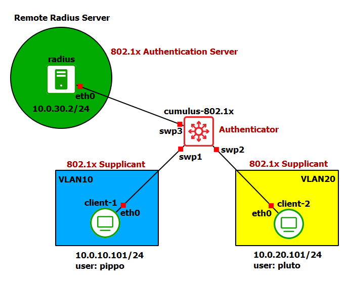

# 802.1x

## Cos'è 802.1x e come funziona

**IEEE 802.1x** è uno standard IEEE utilizzato per l'autenticazione degli utenti o dei dispositivi che cercano di connettersi a una rete Ethernet o Wi-Fi. Il protocollo 802.1x offre un meccanismo di autenticazione basato su porte, il che significa che l'accesso alla rete viene consentito o rifiutato in base all'autenticazione dell'entità che cerca di connettersi a una porta di rete specifica. Nel protocollo 802.1x troviamo tre attori principali:
* *Supplicant (Client)*: è il dispositivo o l'utente che cerca di accedere alla rete. Il supplicant invia le credenziali di autenticazione al sistema di autenticazione. 
* *Authenticator (Switch o Access Point)*: è il dispositivo di rete che agisce come intermediario tra il supplicant e il sistema di autenticazione. L'authenticator richiede l'autenticazione e comunica con il supplicant e il sistema di autenticazione.
* *Sistema di autenticazione (Authentication Server)*: entità che verifica le credenziali del supplicant per determinare se l'accesso alla rete deve essere consentito oppure rifiutato. Questo sistema può essere basato su una varietà di metodi di autenticazione, come username e password, certificati digitali, token hardware, o altre forme di autenticazione.



Di seguito possiamo osservare un esempio del protocollo 802.1x in combinazione con i protocolli EAP, EAPoL e RADIUS:



Per separare le risorse di rete dagli utenti non autenticati si usano VLAN diverse. In questo modo quando un utente si autentica può continuare ad usare la stessa configurazione dell'interfaccia cambiando soltanto la VLAN a cui esso appartiene. Dopo l'autenticazione, il server assegna una ACL all'utente in modo che l'accesso tramite l'authenticator sia controllato dalle regole. Un'alternativa è quella di utilizzare le UCL (User Control List), cioè una collezione di dispositii con gli stessi requisiti di accesso alla rete, impostando poi le regola per la UCL piuttosto che per il singolo device.

## Vulnerabilità
Se un attaccante è in grado di intercettare fisicamente i pacchetti di un utente autenticato, può effettuare i seguenti attacchi:
* Spoofing di IP/MAC e sostituirsi a un utente autenticato accedendo alla rete.
* DoS attraverso invio di pacchetti ```EAPoL-Logoff```: sono pacchetti in chiaro e possono essere inviati da chiunque. 

Per far fronte a queste vulnerabilità sono stati aggiunti allo standard i protocolli MACsec e MACsec Key Agreement.

# Laboratorio


## Configurazione degli switch

#### Switch 1 (scripts/switch1/setup.sh):


## Configurazione dei client

#### Client 1 (scripts/client1/setup.h):


#### Client 2 (scripts/client2/setup.h):


#### Client 3 (scripts/client3/setup.h):


#### Client 4 (scripts/client4/setup.h):


#### Attacker (scripts/attacker/setup.sh):
